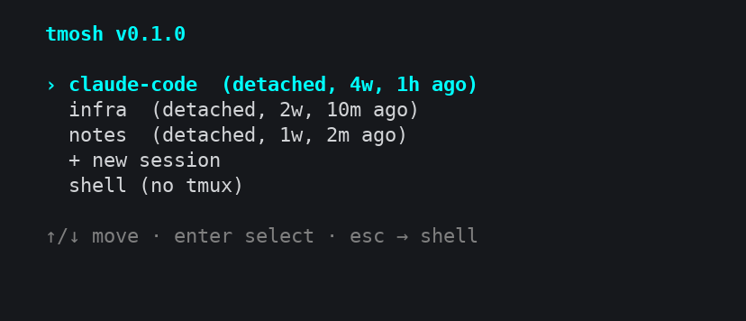

# tmosh

[](https://github.com/totophe/tmosh/actions/workflows/ci.yml)
[](https://github.com/totophe/tmosh/actions/workflows/release.yml)
[](LICENSE)

A tiny Rust tool that greets you on every SSH/[mosh](https://mosh.org/) login and
asks what you want to do:

- **attach** to an existing (detached) tmux session,
- **create** a new tmux session, or
- **drop to the shell** — press <kbd>Esc</kbd> any time as the escape hatch.



It is a single static-ish binary, has no runtime config, and updates itself
omz-style from GitHub Releases.

## Install

One line — downloads the right binary for your OS/arch into `~/.local/bin`:

```sh
curl -fsSL https://raw.githubusercontent.com/totophe/tmosh/main/install.sh | sh
```

Then wire it into your login shell. The installer prints the exact command; it
is simply:

```sh
tmosh --init >> ~/.zshrc     # or ~/.bashrc
source ~/.zshrc
```

`tmosh --init` emits a guarded snippet that only runs in **interactive** shells,
**skips** when you're already inside tmux, and **skips** non-TTY sessions (so
`scp`, `rsync`, and scripted SSH keep working untouched).

Environment knobs for the installer:

| Variable | Default | Purpose |
|---|---|---|
| `TMOSH_INSTALL_DIR` | `~/.local/bin` | where to put the binary |
| `TMOSH_VERSION` | `latest` | install a specific tag, e.g. `v0.1.0` |

## Usage

```
tmosh              Launch the interactive session picker
tmosh --update     Check for and install the latest release
tmosh --init       Print the shell snippet to add to your rc file
tmosh --version    Print version
tmosh --help       Show help
```

In the picker: <kbd>↑</kbd>/<kbd>↓</kbd> (or <kbd>j</kbd>/<kbd>k</kbd>) to move,
<kbd>Enter</kbd> to select, <kbd>Esc</kbd> / <kbd>q</kbd> / <kbd>Ctrl-C</kbd> to
drop straight to the shell.

## Auto-update

On launch, tmosh kicks off a **throttled, detached** background check (at most
once per 24h, recorded in `~/.cache/tmosh/last-update-check`). It never blocks
your login. When a newer release is found it downloads the matching asset and
atomically replaces the running binary. Force it any time with `tmosh --update`.

## How it works

- The shell snippet runs `tmosh` on interactive login.
- tmosh shells out to the `tmux` CLI to list sessions and then `exec`s
  `tmux attach` / `tmux new-session`, so it gets fully out of the way once
  you've chosen — no wrapper process lingering around your session.
- If `tmux` isn't installed or you're already inside a session, it does nothing
  and hands control back to your shell.

## Building from source

Requires a stable Rust toolchain.

```sh
cargo build --release
./target/release/tmosh --help
```

## Releases & CI

- **CI** (`.github/workflows/ci.yml`) runs fmt, clippy (`-D warnings`), tests,
  and a release build on every push/PR.
- **Release** (`.github/workflows/release.yml`) triggers on a `v*` tag. It
  cross-builds for Linux (x86_64, aarch64) and macOS (aarch64), uploads
  each as a **GitHub build artifact**, and publishes them — plus a `SHA256SUMS`
  file — as assets on the **GitHub Release** that the installer and self-updater
  download from.

To cut a release, bump `version` in `Cargo.toml` and push a matching tag — the
workflow verifies they agree before building. See [RELEASING.md](RELEASING.md)
for the full checklist.

```sh
git tag v0.1.0
git push origin v0.1.0
```

## License

MIT — see [LICENSE](LICENSE).
